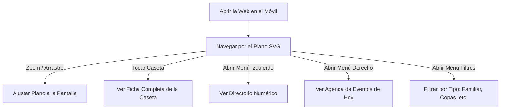

# 🏛️ Manual de Usuario y Guía Funcional: Portal Público de la Feria de Algeciras

Bienvenido al **Manual de Usuario** oficial para el visor público del **Ayuntamiento de Algeciras**. Este documento proporciona una guía paso a paso para que cualquier ciudadano o turista aprenda a navegar, buscar casetas, aplicar filtros y consultar la agenda de eventos de la Feria Real de Algeciras 2026.

---

## 🗺️ 1. Introducción al Mapa Interactivo

El portal público es una herramienta interactiva moderna que te permite explorar de manera dinámica el plano oficial de la feria. Puedes utilizarla directamente desde tu teléfono móvil, tableta u ordenador sin necesidad de instalar ninguna aplicación.



* **Acceso fluido**: Funciona en cualquier navegador de internet moderno (Safari, Chrome, Firefox, Edge).
* **Consumo óptimo**: Diseñado para ser extremadamente rápido, con un gasto mínimo de datos móviles.
* **Resiliencia offline**: Si experimentas problemas de cobertura en el recinto ferial, el mapa base y la información preestablecida seguirán cargando correctamente.

---

## 📱 2. Guía de Navegación por el Plano de Casetas

El plano ferial que ves en el centro de tu pantalla es totalmente interactivo.

### 2.1 Control de Movimiento y Vista (Zoom)
* **En Dispositivos Móviles (Táctil)**:
  * **Desplazamiento**: Desliza un solo dedo en cualquier dirección para moverte de un lado a otro del mapa de la feria.
  * **Zoom (Acercar/Alejar)**: Junta o separa dos dedos sobre la pantalla (gesto de pellizco) para ampliar el plano de las casetas y ver sus ubicaciones con total precisión.
* **En Ordenadores**:
  * **Desplazamiento**: Haz clic izquierdo en una zona vacía del mapa, mantén presionado el botón y arrastra el ratón.
  * **Zoom**: Utiliza la rueda de scroll del ratón (hacia arriba para acercar, hacia abajo para alejar).

### 2.2 Selección e Identificación de Casetas
Cada polígono del mapa corresponde a una caseta física de la feria:
* **Ver detalles**: Toca o haz clic sobre cualquier caseta del plano ferial. Se abrirá una tarjeta emergente en la parte inferior con toda su ficha informativa.
* **Casetas Abiertas vs Cerradas**:
  * **Caseta Abierta (Activa)**: Se muestra con contorno reactivo. Al tocarla, se resalta en un elegante color dorado y abre su ficha de eventos.
  * **Caseta Cerrada (Inactiva)**: Se visualiza de color grisáceo con un estilo tachado. Al tocarla, el sistema te mostrará una advertencia indicando que se encuentra inhabilitada o cerrada temporalmente por motivos administrativos.

---

## 🔍 3. Cómo Utilizar el Buscador de Casetas

El buscador de la cabecera te permite localizar cualquier caseta del recinto ferial de forma instantánea.

```
┌────────────────────────────────────────────────────────┐
│                   [ BUSCADOR EN MÓVIL ]                │
│                                                        │
│  1. Presiona el botón flotante de la Lupa (Cabecera)   │
│  2. Se despliega la barra: [ Escribe aquí... ] [Buscar]│
│  3. Escribe e.g. "Peña" y presiona enter               │
│  4. El plano se desplaza y enfoca la caseta en Dorado │
└────────────────────────────────────────────────────────┘
```

### 3.1 Búsqueda Inteligente y Tolerante
No te preocupes por escribir con perfecta ortografía:
* El buscador es **inteligente e insensible a mayúsculas, minúsculas y tildes**.
* Si buscas `"andalucia"`, el sistema localizará igualmente la caseta `"Casa de Andalucía"`.
* Si buscas términos parciales como `"amig"`, el buscador te mostrará coincidencias como `"Caseta Los Amigos"`.

### 3.2 Comportamiento de Enfoque en el Mapa
Al presionar el botón **"Buscar"** o pulsar la tecla Enter en tu teclado:
1. El buscador cerrará automáticamente el teclado en pantalla en tu móvil para liberar espacio.
2. El plano del mapa **se deslizará de forma automática y suave** hasta enfocar y centrar la caseta localizada en el centro exacto de tu pantalla.
3. El polígono de la caseta en el plano se pintará de un **color dorado brillante** para que la ubiques físicamente a primera vista.

---

## 🏷️ 4. Filtrado por Categorías y Etiquetas (Tags)

Si no buscas una caseta específica, sino un ambiente particular para almorzar o tomar una copa, puedes utilizar el panel de **Filtros**.

### 4.1 Cómo Aplicar Filtros
1. Presiona el botón **"Filtros"** (identificado con un icono de etiquetas) en la barra superior (ordenador) o en la botonera flotante (móvil).
2. Se desplegará un panel lateral que lista todas las categorías disponibles y el número de casetas asociadas a cada una (ej. *Familiar (12), Juvenil (8), Tradicional (15)*).
3. Selecciona una o varias categorías pulsando sobre ellas.
4. El plano del mapa se actualizará en tiempo real: todas las casetas que coincidan con las categorías seleccionadas se resaltarán en el plano con un color **azul-dorado**, mientras que las demás se atenuarán para facilitar su descarte visual.

### 4.2 Restablecer Filtros
Para limpiar los filtros aplicados y volver a visualizar el plano con todas las casetas generales, simplemente presiona el botón **"Todas"** que se encuentra en la cabecera de la lista del panel de filtros.

---

## 📅 5. El Directorio y la Agenda de Eventos Diarios

El portal te ofrece dos cajones laterales deslizantes (cajón izquierdo y cajón derecho) para guiarte en tu visita:

### 5.1 Directorio de Casetas (Menú Izquierdo)
* **Acceso**: Presiona el botón **"Casetas"** (icono de tienda de feria).
* **Uso**: Verás un listado ordenado numéricamente de todas las casetas autorizadas de la feria. Si tocas cualquier nombre de la lista, el mapa centrará el plano automáticamente en esa caseta y la resaltará en color dorado para que la encuentres en segundos.

### 5.2 Agenda de Actividades de Hoy (Menú Derecho)
* **Acceso**: En móviles se abre pulsando el botón **"Eventos"** (icono de calendario). En ordenador permanece siempre visible en el lateral derecho de tu pantalla.
* **Secciones**:
  * **Pestaña "Destacados"**: Te muestra 4 sugerencias de eventos atractivos seleccionados de forma aleatoria para la jornada de hoy. ¡Una excelente forma de descubrir actividades!
  * **Pestaña "Ahora"**: Compara la hora real de tu teléfono móvil con el horario de los eventos programados en toda la feria y te muestra en tiempo real una lista de las actividades que están teniendo lugar en este mismo instante (en la franja horaria actual).
  * **Acción de Enfoque**: Si tocas cualquier tarjeta de evento de estas listas, el panel se cerrará y el plano del mapa te llevará suavemente a enfocar la caseta exacta donde se está celebrando la actividad.

---

## 📑 6. Lectura Completa de la Ficha de una Caseta

Al pulsar sobre una caseta en el mapa o buscarla, se desplegará una ventana emergente premium en la zona inferior de tu pantalla. Esta ficha contiene:

```
┌────────────────────────────────────────────────────────┐
│ [Nº Caseta] NOMBRE DE LA CASETA                       ✕│
├────────────────────────────────────────────────────────┤
│ [Badge: Familiar] [Badge: Tradicional]                 │
│                                                        │
│ ┌────────────────────────────────────────────────────┐ │
│ │                  Imagen de Portada                 │ │
│ └────────────────────────────────────────────────────┘ │
│                                                        │
│  (ℹ️ Leer Descripción)                                  │
│                                                        │
│  SELECCIONA EL DÍA:                                    │
│  ┌──────────────────────────────────────────────────┐  │
│  │ [Día 20] [Día 21] [Día 22] [Día 23] ... [Día 28] │  │
│  └──────────────────────────────────────────────────┘  │
│                                                        │
│  PROGRAMACIÓN DEL DÍA SELECCIONADO:                    │
│  • 14:30 - Almuerzo familiar y cante flamenco          │
│  • 22:00 - Actuación de orquesta en directo            │
└────────────────────────────────────────────────────────┘
```

* **Fotografía de Portada**: Muestra el decorado o fachada de la caseta para que puedas reconocerla físicamente al pasar por su calle.
* **Etiquetas de Ambiente**: Badges visuales que te indican el tipo de ambiente (comida tradicional, copas, conciertos, juvenil, etc.).
* **Botón "Leer Descripción"**: Al pulsarlo, abre una pequeña tarjeta flotante donde podrás leer la reseña e historia de la caseta, especialidades culinarias y dedicatorias de sus socios.
* **Planificador por Días (Selector del Día 20 al Día 28)**:
  * Te permite consultar la agenda de eventos para cualquier día de la feria de forma anticipada.
  * Desliza tu dedo de forma horizontal sobre la botonera de días y pulsa sobre el día deseado (ej. *Día 24* o *Día 28*).
  * La lista inferior de eventos se actualizará al instante con las actividades programadas para la fecha seleccionada.

---

## 💡 7. Consejos para una Experiencia Óptima

* **Navegación en el Recinto**: Si estás físicamente en la feria caminando por sus calles, utiliza el directorio de casetas (Menú Izquierdo) para localizar el número físico de la caseta a la que deseas ir, y luego guíate con la planimetría visual del mapa interactivo.
* **Consulta el Menú "Ahora"**: Antes de decidir a qué caseta ir a bailar o comer, revisa la pestaña "Ahora" en el menú derecho para comprobar qué espectáculos, degustaciones o actividades se están celebrando en este preciso instante en las casetas cercanas.
* **Cierra con Escape**: Si estás utilizando un ordenador con teclado físico, puedes cerrar cómodamente cualquier panel lateral o buscador presionando la tecla **Esc (Escape)** de tu teclado.

---

*Manual de Usuario de la Feria de Algeciras 2026*  
*Ayuntamiento de Algeciras — Área de Innovación y Tecnología*
