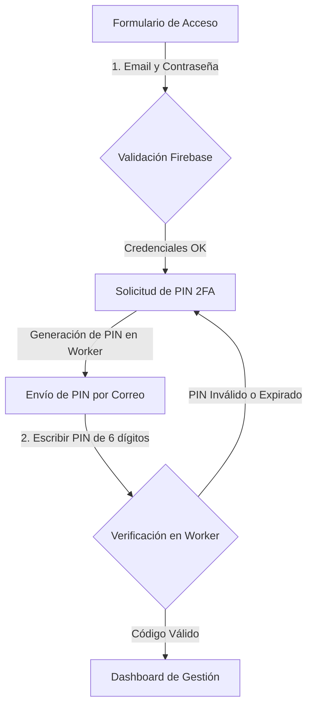

# 🏛️ Manual de Usuario y Guía Funcional: Portal del Casetero

Esta documentación proporciona una guía de uso completa y funcional para los propietarios y gestores de casetas autorizados (rama `Casetero`). El portal les permite administrar de forma segura la identidad visual de su caseta (descripción, etiquetas y fotografías) y planificar su agenda de actividades diarias para la Feria Real de Algeciras 2026.

---

## 🔐 1. Flujo de Acceso Seguro (Autenticación y Doble Factor)

Para salvaguardar la integridad de la base de datos municipal, el acceso al portal del casetero está protegido por un sistema de **doble factor de autenticación (2FA)**.



### Paso A: Credenciales Básicas
1. Abre el portal en tu navegador.
2. Introduce tu **Correo Electrónico** y **Contraseña** suministrada por el Ayuntamiento.
3. Presiona **"Iniciar Sesión"**.

### Paso B: Validación por Doble Factor (PIN de 6 dígitos)
1. Al validar tus credenciales, el sistema te redirigirá automáticamente a la pantalla de verificación 2FA y enviará un código numérico temporal de **6 dígitos** a tu buzón de correo.
2. Introduce el código en la casilla segmentada.
3. Presiona **"Verificar Código"** para acceder a tu panel de control.

> [!WARNING]
> **Caducidad e Intentos Máximos del Código**:
> * Cada código enviado tiene un **límite de expiración de 24 horas**.
> * Dispones de un **máximo de 3 intentos** para introducir el código. Si fallas las 3 oportunidades, el código quedará bloqueado y destruido automáticamente por seguridad, obligándote a solicitar uno nuevo.

> [!NOTE]
> **Tolerancia a fallos en Modo de Prueba (Sandbox)**:
> Si la API de envío de correos experimenta bloqueos temporales por límites del Sandbox, el portal te mostrará una **advertencia en verde**. Podrás completar tu prueba recuperando el código temporal de verificación directamente desde la base de datos de Firestore (colección `codigos_2fa` con tu UID) sin quedar atascado.

---

## ⌛ 2. Seguridad de Sesión y Cierre Automático

El portal implementa políticas de seguridad estrictas en el navegador para impedir accesos no autorizados en dispositivos públicos:

1. **Cierre por Recarga (F5)**: Las credenciales de la sesión se almacenan únicamente en la memoria de la aplicación (`inMemoryPersistence`). Si recargas la página o pulsas F5, la sesión se cerrará de forma instantánea.
2. **Cierre por Cierre de Pestaña**: La vinculación a tu caseta se almacena en variables de sesión temporal (`sessionStorage`). Si cierras la pestaña o el navegador web, los datos de acceso se destruirán, obligándote a pasar el control 2FA al volver a entrar.
3. **Advertencia de Protocolo Local (file:///)**: Si intentas ejecutar la página web localmente haciendo doble clic en el archivo HTML (`file:///index.html`), el sistema mostrará una advertencia en la cabecera e inhabilitará los botones de acceso, ya que los navegadores bloquean las llamadas de seguridad (CORS) bajo este protocolo.

---

## 🏛️ 3. Gestión y Edición del Perfil de la Caseta

Una vez dentro de tu panel de control, se te presentará un formulario interactivo unificado para actualizar la información de tu caseta.

```
┌────────────────────────────────────────────────────────┐
│  Panel del Casetero                                  ✕ │
├────────────────────────────────────────────────────────┤
│  [Campo Bloqueado] Nº Caseta: 14                       │
│  [Campo Bloqueado] Nombre: Peña El Estribo             │
│                                                        │
│  ETIQUETAS ASOCIADAS:                                  │
│  [Pública] [Privada (Sel)] [Tradicional (Sel)] [...]  │
│                                                        │
│  ZONA DE IMAGEN DE PORTADA:                            │
│  • Restricción: Solo imágenes HORIZONTALES (Apaisadas)  │
│  • Compresión de peso inteligente automática           │
│  [Subir Archivo]                     (Eliminar Portada)│
│                                                        │
│  DESCRIPCIÓN DE LA CASETA:                             │
│  [ Escribe aquí la historia o especialidades...     ]  │
│                                                        │
│  PLANIFICADOR DE EVENTOS DIARIOS (DÍA 20 al DÍA 28):   │
│  [Día 20] [Día 21] [Día 22] ... [Día 28]               │
│  • 14:00 - Comida de socios ─────── (Eliminar Evento)  │
│  • [ Hora ] [ Nombre del Evento ]  (+ Añadir Evento)   │
├────────────────────────────────────────────────────────┤
│  💾 GUARDAR CAMBIOS (Actualizar base de datos)         │
└────────────────────────────────────────────────────────┘
```

### 3.1 Datos Oficiales Bloqueados
* Los campos **"Nº de Caseta"** y **"Nombre"** son cargados de forma automática desde el censo del Ayuntamiento y se encuentran **protegidos contra escritura** (aparecen en color gris). Esto impide que se alteren los identificadores oficiales del mapa.

### 3.2 Selección de Etiquetas (Tags Badges)
* El panel muestra una botonera con etiquetas predefinidas aprobadas por el Ayuntamiento (ej. *Pública, Privada, Tradicional, Moderna, Familiar, Juvenil, Comida, Copas, Conciertos*).
* Haz clic sobre las etiquetas que describan el ambiente de tu caseta para encenderlas (se pondrán en color azul). Puedes deseleccionarlas volviendo a pulsar sobre ellas.

### 3.3 Subida de Imagen de Portada (Límite Horizontal)
* **Verificación de Formato (Restricción Apaisada)**: Para evitar descuadres estéticos en la visualización de los visitantes, el portal **prohíbe la subida de fotos verticales**. Si intentas subir una imagen más alta que ancha, el sistema cancelará la operación y te mostrará un mensaje de advertencia.
* **Compresión Inteligente Automática**: No te preocupes por el peso de la imagen de tu cámara. Al seleccionarla, la web realiza una compresión de peso local inmediata a un tamaño óptimo horizontal de resolución y peso ligero en JPEG, reduciendo el consumo de tus datos.
* **Eliminación de la Foto**: Si deseas borrar la portada actual y dejar tu caseta sin imagen, presiona el botón rojo **"Eliminar"** que aparecerá debajo del selector de archivos.

### 3.4 Descripción Extendida
* Un cuadro de texto amplio donde puedes detallar la biografía de la peña, su oferta gastronómica, menús especiales o información cultural que desees compartir con el público.

---

## 📅 4. Planificador de la Agenda de Eventos Semanales

El panel incorpora un módulo dinámico para crear y mantener actualizado el itinerario de actividades diarias de la feria.

1. **Selección del Día**: Haz clic sobre la pestaña del día que desees editar (desde el **Día 20 hasta el Día 28**). La lista inferior cambiará para mostrarte las actividades guardadas en esa fecha específica.
2. **Agregar Actividades**:
   * Escribe la hora en el campo correspondiente (ej. `14:30` o `22:00`).
   * Escribe la actividad en el campo de descripción (ej. `Degustación de paella gratis` o `Actuación del grupo flamenco`).
   * Presiona el botón verde **"Añadir Evento"**. La actividad se unirá instantáneamente a la lista de ese día.
3. **Eliminar Actividades**: Si un evento se cancela o deseas corregirlo, presiona el icono de la **papelera roja** situado a la derecha del evento en el listado para borrarlo del itinerario actual.

---

## 💾 5. Persistencia de Cambios y Salida del Panel

* **Guardar Cambios**: Tras realizar todas las modificaciones en tus etiquetas, portada, descripción y agenda de eventos, presiona el botón central **"Guardar Cambios"**.
  * El sistema compactará los datos, eliminará referencias a variables legadas y actualizará la base de datos de Firebase. 
  * Se desplegará una tarjeta de alerta en verde confirmando el guardado exitoso. Los cambios se reflejarán inmediatamente en el portal público de los visitantes.
* **Cerrar Sesión**: Cuando termines de gestionar tu información, presiona el botón **"Cerrar Sesión"** (icono con la puerta de salida) situado en la cabecera superior derecha para salir de forma segura y bloquear tu panel.

---

*Manual del Portal del Casetero - Feria de Algeciras 2026*  
*Ayuntamiento de Algeciras — Área de Innovación y Tecnología*
