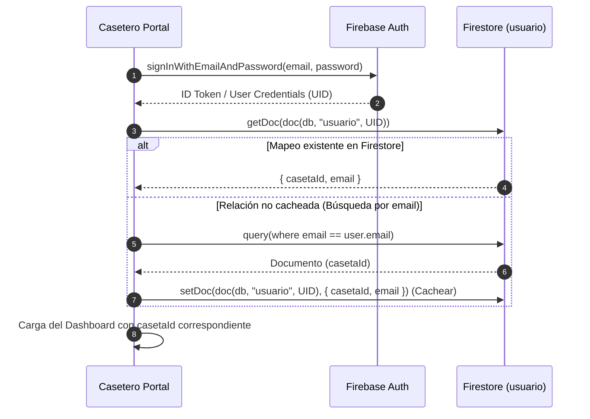
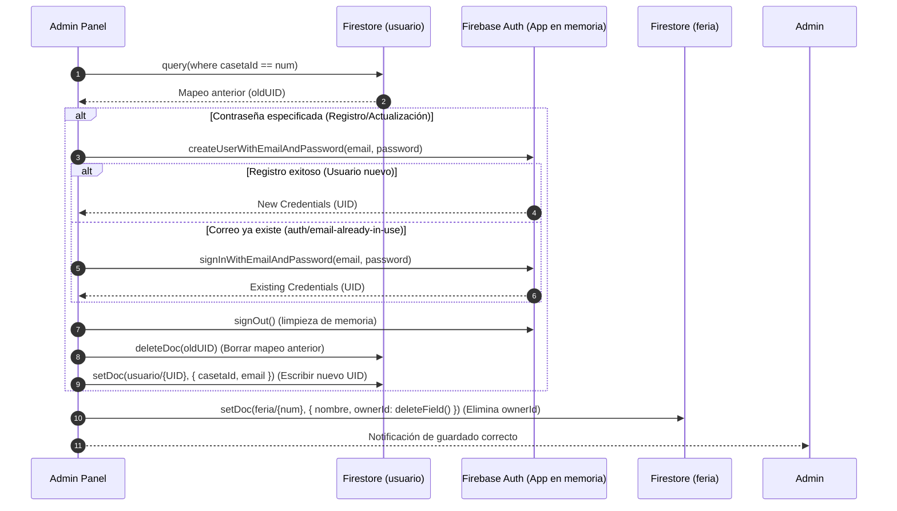

# Manual Técnico de Desarrollo y Despliegue - Feria Local de Algeciras

Este repositorio contiene la arquitectura cliente-servidor para la gestión, control y visualización del mapa interactivo y programación de la Feria de Algeciras. La arquitectura ha sido optimizada para un funcionamiento **100% descentralizado e independiente de backends intermediarios (Cloudflare Workers, APIs de terceros o microservicios de 2FA)**, conectando directamente el frontend con la base de datos de Firebase.

---

## 1. Arquitectura de Datos (Firestore)

El sistema utiliza **Firebase Firestore** como base de datos en tiempo real y **Firebase Authentication** para la gestión de accesos. Para lograr la máxima eficiencia y consistencia relacional sin duplicados, las colecciones se definen bajo las siguientes especificaciones técnicas:

```
                               ┌────────────────────────────────┐
                               │     Firebase Authentication    │
                               │  (Registro seguro de usuarios) │
                               └──────────────┬─────────────────┘
                                              │
                                              │ UID (Generado en Auth)
                                              ▼
┌───────────────────────────┐    1:1   ┌────────────────────────────────┐
│   Colección 'usuario'     ├─────────►│     Colección 'feria'          │
│   (Mapeo e ID de Caseta)  │          │   (Configuración de Casetas)   │
│                           │          │                                │
│  - Document ID: UID       │          │  - Document ID: p01 a p56      │
│  - casetaId: "pXX"        │          │  - nombre: "EL PITO", etc.     │
│  - email: "correo@..."    │          │  - estatus: true/false         │
|                           |          │  - programacion: { ... }       │
└───────────────────────────┘          └────────────────────────────────┘
```

### A. Colección `usuario` (Punto de anclaje de autenticación)
Cada documento tiene como ID de documento el **UID de Authentication**.
*   **Propósito:** Sirve para relacionar de forma directa un usuario logueado con su respectiva caseta sin exponer credenciales.
*   **Campos:**
    ```json
    {
      "casetaId": "p01",
      "email": "raulbarrios@gmail.com"
    }
    ```

### B. Colección `feria` (Información de la Feria)
Contiene 56 documentos estáticos (`p01` a `p56`) para las casetas de la feria, además del documento de control global de `etiquetas`.
*   **Propósito:** Almacena la ficha pública, imágenes de portada (en Base64 comprimido), estado de visibilidad en el mapa, tags de ambiente y la programación por días.
*   **Campos:**
    ```json
    {
      "numero": "1",
      "nombre": "EL PITO",
      "descripcion": "Descripción del ambiente de la caseta...",
      "imagen": "data:image/jpeg;base64,...",
      "portada_url": "data:image/jpeg;base64,...",
      "estatus": true,
      "etiquetas": ["Pública", "Comida", "Familiar"],
      "programacion": {
        "Día 20": [{"hora": "14:00", "actividad": "Concierto Flamenquito"}],
        "Día 21": [],
        ...
        "Día 28": []
      }
    }
    ```
    *Nota: Se ha depurado el campo duplicado `ownerId` de esta colección utilizando `deleteField()` en los procesos de guardado para centralizar las relaciones en la colección `usuario`.*

---

## 2. Reglas de Seguridad en Firebase Firestore

Para asegurar la integridad de la base de datos sin un servidor intermedio, debes implementar las siguientes reglas en la consola de Firebase Firestore. Estas reglas garantizan que el administrador y los usuarios tengan permisos estrictos basados en sus roles:

```javascript
rules_version = '2';
service cloud.firestore {
  match /databases/{database}/documents {

    // 1. Reglas para la colección 'usuario'
    match /usuario/{uid} {
      // Lectura: El Administrador Supremo y el propio casetero autenticado
      allow read: if request.auth != null && (
        request.auth.uid == "Zl0KUSFsvmNS19yjckiZ0n4VIig2" || 
        request.auth.uid == uid
      );
      // Escritura: Únicamente el Administrador Supremo tiene permisos de administración directa
      allow write: if request.auth != null && 
        request.auth.uid == "Zl0KUSFsvmNS19yjckiZ0n4VIig2";
    }

    // 2. Reglas para la colección 'feria' (las casetas p01-p56 y etiquetas)
    match /feria/{documento} {
      // Lectura: Público general (el mapa de la feria es de libre lectura)
      allow read: isTrue;
      
      // Escritura: 
      // A. El Administrador Supremo tiene control total.
      // B. Un casetero autenticado puede modificar los datos de su propia caseta (descripcion, imagen, programacion)
      //    siempre que el documento 'usuario/{uid}' coincida con el documento de la caseta solicitado.
      allow write: if request.auth != null && (
        request.auth.uid == "Zl0KUSFsvmNS19yjckiZ0n4VIig2" ||
        get(/databases/$(database)/documents/usuario/$(request.auth.uid)).data.casetaId == documento
      );
    }

    // 3. Reglas para la colección de validación del Administrador
    match /admin_only/verificar {
      // Solo el Administrador Supremo puede leer este documento para verificar su rol al iniciar sesión
      allow read: if request.auth != null && request.auth.uid == "Zl0KUSFsvmNS19yjckiZ0n4VIig2";
      allow write: if false;
    }
  }
}
```

---

## 3. Flujos de Trabajo e Implementación de Código

### A. Flujo de Acceso del Casetero (Rama `Casetero`)

Cuando un casetero inicia sesión con su correo y contraseña, el frontend realiza una doble comprobación en tiempo real para asignarle su caseta sin usar intermediarios:



### B. Gestión de Credenciales en el Administrador (Rama `Administrador`)

Para crear y gestionar accesos de caseteros sin un backend, el panel de administración implementa un **diseño de App Secundaria de Firebase en memoria**. Esto evita que al crear o validar un casetero, la sesión del administrador activo sea interrumpida:



---

## 4. Estructura del Servidor en Kali PC

La máquina física con Kali Linux sirve todos los portales de la feria de forma paralela en el **Puerto 80** mediante subdirectorios (rutas relativas) gestionados por **Nginx**.

### A. Estructura de Directorios en `/var/www/`
```
/var/www/feria/
├── main/            <-- Rama 'main' (Servido en la raíz '/' - Selector de Portales)
│   ├── index.html
│   └── fotos/
├── casetero/        <-- Rama 'Casetero' (Servido en '/casetero/')
│   ├── index.html
│   ├── script.js
│   └── style.css
├── administrador/   <-- Rama 'Administrador' (Servido en '/administrador/')
│   ├── index.html
│   ├── script.js
│   └── style.css
└── publico/         <-- Rama 'Publico' (Servido en '/publico/' - Mapa Ciudadano)
    ├── index.html
    ├── script.js
    └── style.css
```

### B. Configuración de Virtual Hosts de Nginx
Edita el archivo `/etc/nginx/sites-available/feria-local` con la siguiente configuración:

```nginx
server {
    listen 80;
    server_name localhost;

    # 1. Selector de Portales / Landing Page (Ruta Raíz)
    location / {
        root /var/www/feria/main;
        index index.html;
        try_files $uri $uri/ =404;
    }

    # 2. Portal Caseteros (Ruta /casetero/)
    location = /casetero {
        return 301 $scheme://$http_host/casetero/;
    }
    location /casetero/ {
        alias /var/www/feria/casetero/;
        index index.html;
        try_files $uri $uri/ =404;
    }

    # 3. Panel Administrador (Ruta /administrador/)
    location = /administrador {
        return 301 $scheme://$http_host/administrador/;
    }
    location /administrador/ {
        alias /var/www/feria/administrador/;
        index index.html;
        try_files $uri $uri/ =404;
    }

    # 4. Mapa Público (Ruta /publico/)
    location = /publico {
        return 301 $scheme://$http_host/publico/;
    }
    location /publico/ {
        alias /var/www/feria/publico/;
        index index.html;
        try_files $uri $uri/ =404;
    }
}
```

Habilita la configuración y deshabilita la predeterminada:
```bash
sudo ln -sf /etc/nginx/sites-available/feria-local /etc/nginx/sites-enabled/
sudo rm -f /etc/nginx/sites-enabled/default
```

### C. Arranque Automático en el Sistema
Habilita los servicios del sistema para que inicien automáticamente en cada encendido y reinicio del PC de Kali:
```bash
# Servidor Web Nginx
sudo systemctl enable nginx
sudo systemctl start nginx

# Servidor SSH (Para despliegue remoto)
sudo systemctl enable ssh
sudo systemctl start ssh
```

### D. Configuración de Permisos
Aplica los permisos del servidor para asegurar que Nginx pueda servir las páginas sin errores de tipo *403 Forbidden*:
```bash
sudo chown -R $USER:www-data /var/www/feria
sudo find /var/www/feria -type d -exec chmod 755 {} \;
sudo find /var/www/feria -type f -exec chmod 644 {} \;
```

---

## 5. Procedimiento de Despliegue de Cambios (PowerShell Windows -> Kali)

Si estás trabajando en local en tu máquina Windows y quieres pasar los cambios directamente a tu Kali sin tocar GitHub, usa el script de PowerShell `desplegar-kali.ps1` que se encuentra en la raíz del proyecto. Este script:
1. Genera paquetes `.tar` de las tres ramas locales (`Publico`, `Casetero`, `Administrador`).
2. Los transfiere por `scp` al directorio `/tmp` de Kali.
3. Se conecta vía `ssh`, extrae los paquetes en los directorios de Nginx y configura los permisos necesarios automáticamente.

Para ejecutarlo:
```powershell
./desplegar-kali.ps1
```

---

## 6. Solución a Problemas Comunes (Troubleshooting)

1. **Error de autenticación (`auth/unauthorized-domain`) al acceder desde otro PC de la red local:**
   * **Causa:** Firebase Authentication bloquea inicios de sesión provenientes de dominios o IPs no registrados por seguridad.
   * **Solución:** Accede a la Consola de Firebase -> Authentication -> Settings -> Authorized Domains. Añade la dirección IP de tu Kali PC (ej: `192.168.1.15`).

2. **Error al intentar actualizar la caseta: "Si cambias el correo de la caseta, debes especificar una contraseña..."**
   * **Causa:** Has introducido un correo nuevo para una caseta pero no has rellenado el campo de contraseña. Sin contraseña, el cliente no puede registrar la cuenta en Authentication y obtener el UID.
   * **Solución:** Si estás cambiando de correo/dueño, debes rellenar obligatoriamente una contraseña inicial en el campo correspondiente del panel.

3. **El casetero no puede acceder a su panel tras cambiar la contraseña:**
   * **Causa:** Si el usuario ya estaba registrado en Firebase Authentication y se intenta registrar de nuevo con el mismo correo pero distinta contraseña, el panel bloqueará el cambio a menos que la contraseña introducida coincida con la cuenta existente en Firebase Auth (esto se hace para evitar secuestro de cuentas).
   * **Solución:** Si deseas cambiar la contraseña de una cuenta de casetero que ya está registrada en Firebase, debes realizar el cambio directamente en el panel de **Firebase Console -> Authentication -> Users**.
